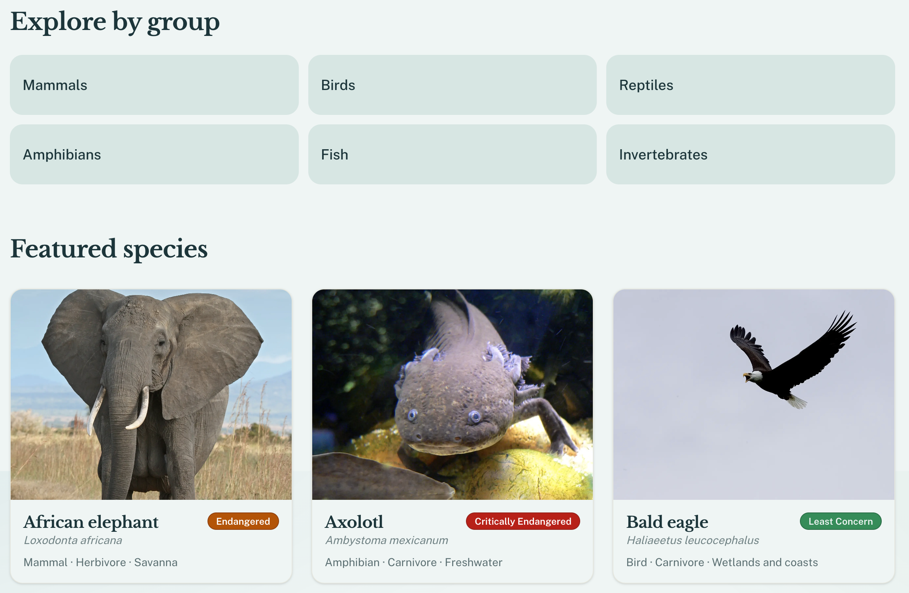

# Fauna

[](https://github.com/andrewbaisden/fauna/actions/workflows/ci.yml)

[](#license-and-responsible-use)

Fauna is an interactive wildlife encyclopedia and digital field guide. Open the catalogue, read a species the way a field guide is written, and — where a licensed model exists — turn the specimen around in 3D.

It records measurable biology: size, mass, speed, diet, habitat, conservation status, and life stages, each tied to a source you can check.



## What you can do

- **Discover** a curated launch catalogue of 30 species, grouped as mammals, birds, reptiles, amphibians, fish, and invertebrates.
- **Search and filter** by name, group, diet, size, activity, and conservation status. Filter URLs are shareable.
- **Read a profile** with measurements, taxonomy, life stages, adaptations, behaviour, habitat, and conservation.
- **Inspect a specimen** in an isolated 3D viewer when a licensed model is available. Profiles fall back to photography when it is not.
- **Compare two species** side by side, including a 2D scale reference.
- **Follow habitat and taxonomy hubs**, and see an illustrative range map with a written region list.
- **Save favourites** with an optional account. Browsing the catalogue needs no login.

## Getting started

You need Node.js 22, [pnpm](https://pnpm.io) 12, and PostgreSQL 16. Docker Compose is the simplest database.

```bash
pnpm install
cp .env.example .env
docker compose up -d
pnpm db:generate
pnpm db:migrate
pnpm content:expand
pnpm db:seed
pnpm dev
```

Open [http://localhost:3000](http://localhost:3000).

Copy `.env.example` and set `DATABASE_URL`, `BETTER_AUTH_SECRET` (at least 32 characters), and `BETTER_AUTH_URL`. The Compose database already matches the example URL (`fauna:fauna` on port 5432).

3D models are fetched or generated locally; they are not stored in git. See [ASSETS.md](ASSETS.md) before loading meshes. Environment variables, a Homebrew Postgres setup, tests, and deployment are in [DEVELOPMENT.md](DEVELOPMENT.md).

## Documentation

| Guide | Contents |
| --- | --- |
| [DEVELOPMENT.md](DEVELOPMENT.md) | Stack, environment, tests, and deployment |
| [ARCHITECTURE.md](ARCHITECTURE.md) | Layers, routes, measurements, 3D, and maps |
| [ASSETS.md](ASSETS.md) | Photographs, 3D models, and their licenses |
| [TESTING.md](TESTING.md) | Unit, component, and end-to-end tests |
| [DECISIONS.md](DECISIONS.md) | Architecture decisions |

## License and responsible use

Fauna is an educational field guide. Use it to look up structured facts, original explanations, and the sources those facts cite.

- **Conservation status is curated and dated.** It is a stored assessment, not a live query of the [IUCN Red List](https://www.iucnredlist.org/). Check IUCN before relying on a status for research, policy, or fieldwork.
- **Measurements are ranges**, stored in canonical units and converted for display. They are biology, not scores.
- **Range maps are illustrative.** Every map has a written region list. Polygons are not IUCN spatial data.
- **Photographs** come from Wikimedia Commons. Each image keeps its creator, source, license, and attribution.
- **3D models** keep creator, source URL, license, and attribution. Some catalogue meshes are CC BY-NC (or a non-commercial variant). Host those only on a non-commercial instance, or replace them before any commercial deploy. Allowed production licenses and the import checklist are in [ASSETS.md](ASSETS.md).
- **Do not treat the writing as a copy of another encyclopedia.** Explanations in the catalogue are original and sit next to citations.

This repository does not yet include an open-source license for the application code. Content licenses above are separate from the code. Until a `LICENSE` file is added, do not redistribute the source.
